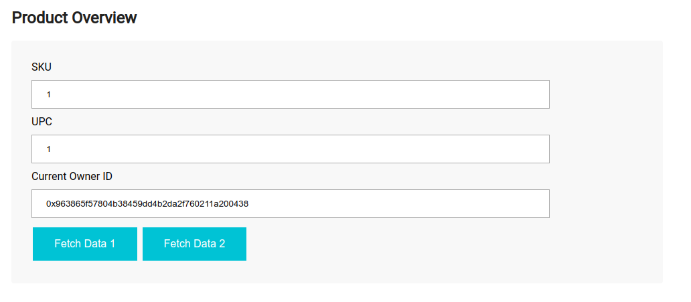
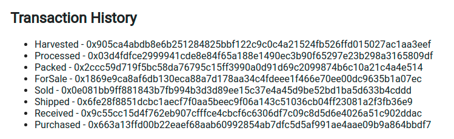
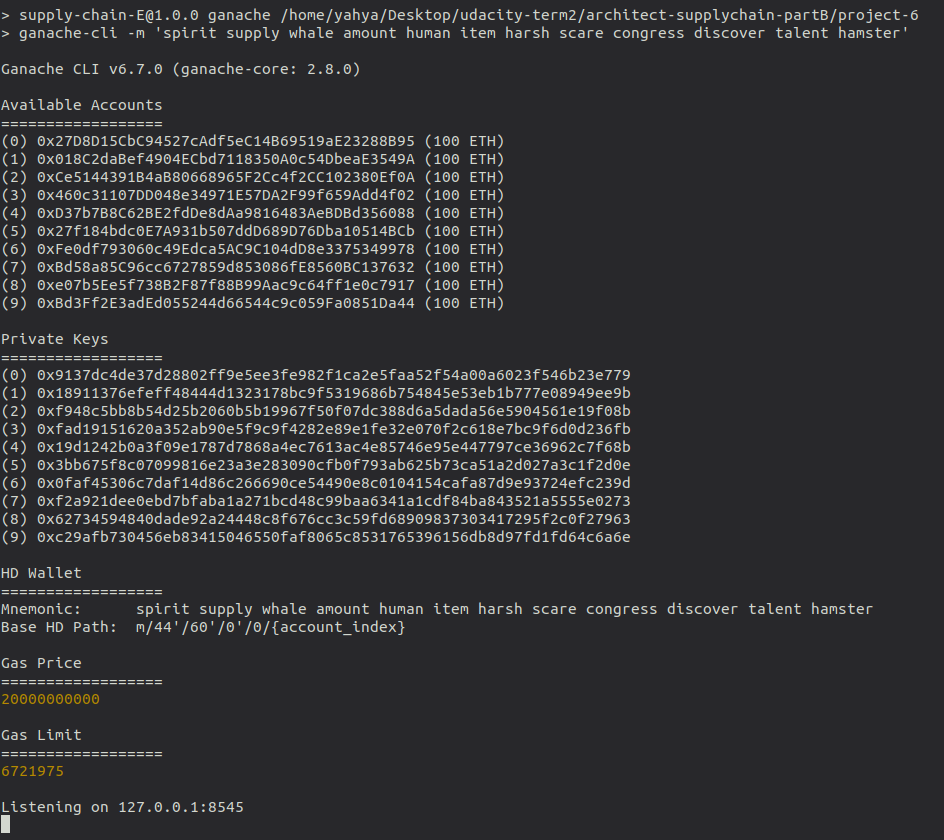
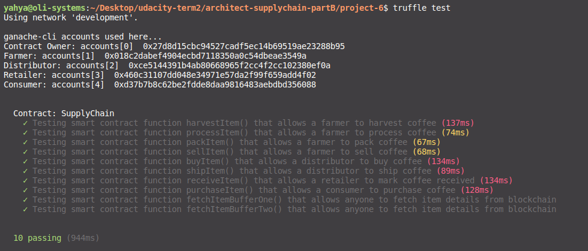
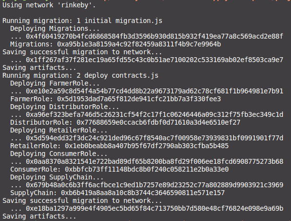

# Fair Trade Coffee
Prove the authenticity of coffee using the Ethereum blockchain.

[TOC]

## Description
This repository containts an Ethereum DApp that demonstrates a Supply Chain flow between a Seller and Buyer. The user story is similar to any commonly used supply chain process. A Seller can add items to the inventory system stored in the blockchain. A Buyer can purchase such items from the inventory system. Additionally a Seller can mark an item as Shipped, and similarly a Buyer can mark an item as Received.

## User Interface
The DApp User Interface when running has following sections:

#### Product Overview Section
User can fetch product overview from this section.


#### Farm Details Section
This section exposes `harvestItem()`, `processItem()`,`packItem()`, and `sellItem()` functionalities to farmer.


#### Product Details Section
In this section `buyItem()`, `shipItem()`,`receiveItem()`, and `buyItem()` functionalities are available.


#### Transaction History Section
All the transaction IDs are listed in this section.



## Getting Started

These instructions will get you a copy of the project up and running on your local machine for development and testing purposes. See deployment for notes on how to deploy the project on a live system.

### Prerequisites

Please make sure you've already installed ganache-cli, Truffle and enabled MetaMask extension in your browser.

```
* Truffle v4.1.16 (core: 4)
* Solidity - ^0.4.25 (solc-js)
* Node v10.16.3
```

### Installing

A step by step series of examples that tell you have to get a development env running

1. Clone this repository:

```
git clone https://github.com/m-yahya/architect-supplychain-partB
```

2. Change directory to ```app``` folder and install all requisite npm packages (as listed in ```package.json```):

```
cd project-6
npm install
```

3. Launch Ganache:

```
ganache-cli -m "spirit supply whale amount human item harsh scare congress discover talent hamster"
```

Your terminal should look something like this:



4. In a separate terminal window, Compile smart contracts:

```
truffle compile
```

This will create the smart contract artifacts in folder ```build\contracts```.

5. Migrate smart contracts to the locally running blockchain, ganache-cli:

```
truffle migrate
```

6. Test smart contracts:

```
truffle test
```

All 10 tests should pass.



7. In a separate terminal window, launch the DApp:

```
npm run dev
```

## Deployed Contract (Rinkeby) 
* Transaction ID – 0x679b48a0c6b3ff6acfbce1c9ed1b7257e89d23252c77a802889d9903921c3969 
* Contract ID – 0xb6b419a8aa8a10c8b3744c3646590811e571e157

* https://rinkeby.etherscan.io/address/0xb6b419a8aa8a10c8b3744c3646590811e571e157


## Built With

* [Ethereum](https://www.ethereum.org/) - Ethereum is a decentralized platform that runs smart contracts
* [IPFS](https://ipfs.io/) - IPFS is the Distributed Web | A peer-to-peer hypermedia protocol
to make the web faster, safer, and more open.
* [Truffle Framework](http://truffleframework.com/) - Truffle is the most popular development framework for Ethereum with a mission to make your life a whole lot easier.

## Contributing
Pull requests are welcome. 

1. Fork the repository.
2. Create your new feature branch: `git checkout -b new-feature-branch`
3. Stage your changes: `git add .`
4. Commit the changes: `git commit -m "add commit message"`
5. `push` to the branch: `git push origin new-feature-branch`
6. Submit a `pull request`.

## Acknowledgments

* Solidity
* Ganache-cli
* Truffle
* IPFS
